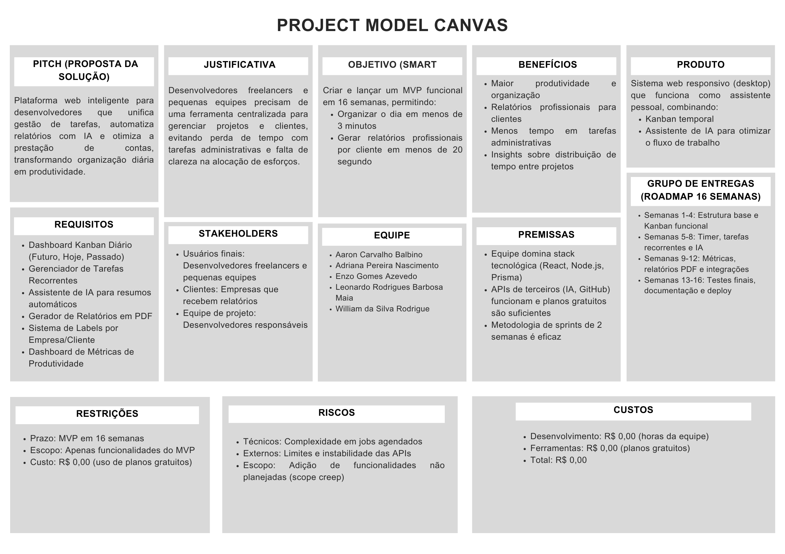

# Project Model Canvas – Companion

## Justificativa
Empresas têm dificuldade em organizar tarefas e gerar relatórios.  
Isso causa perda de produtividade e falhas na prestação de contas.

## Objetivos
- Criar um sistema híbrido (Kanban + Diário) com IA  
- Reduzir tempo de planejamento e aumentar execução  
- Melhorar clareza e produtividade

## Benefícios
- Organização simples e prática  
- Relatórios rápidos e profissionais  
- Mais controle do tempo gasto

## Imagem do Project Model Canvas

# Etapa 5 - Apresentação da Solução

- Apresentação para Mostra de Extensão Eixo 5 ADS:
  - descrição do cliente,
  - objetivo da aplicação,
  - telas principais,
  - pontos positivos e desafios da experiência extensionista,
  - conclusão da equipe.
- Vídeo de apresentação da solução:
  - tamanho do arquivo limitado a 90Mb;
  - taxa de FPS limitada a 30 quadros por segundo;
  - resolução HD (720p) ou Full HD (1080p);
  - formato mp4.
