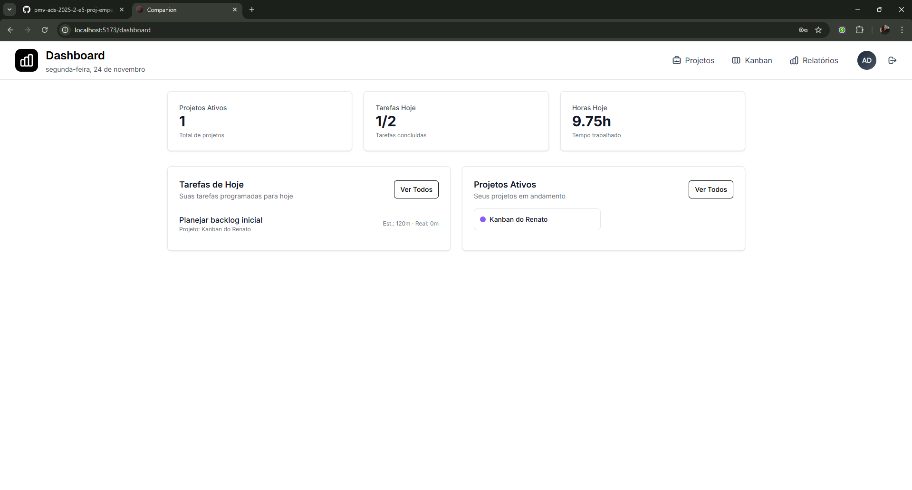

# RF-009

## Dashboard de métricas: tempo por projeto /tipo de tarefa, histórico semanal/mensal

<table>
  <tr>
    <th colspan="6" width="1000">CT-RF-00901 Renderização e Layout do Dashboard</th>
  </tr>
  <tr>
    <td width="170"><strong>Critérios de êxito</strong></td>
    <td colspan="5">
      Ao acessar a rota <code>/dashboard</code>, o sistema deve carregar os componentes visuais (cards de resumo e gráficos) sem erros. O layout deve ser responsivo e apresentar os indicadores de "Projetos Ativos", "Tarefas Hoje" e "Horas Hoje".
    </td>
  </tr>
  <tr>
    <td><strong>Responsável pela funcionalidade</strong></td>
    <td width="430">
      Desenvolvimento: William da Silva Rodrigues 
      Teste: Gustavo Luiz Andrade Costa
    </td>
    <td width="100"><strong>Data do Teste</strong></td>
    <td width="150">24/11/2025</td>
  </tr>
  <tr>
    <td width="170"><strong>Comentário</strong></td>
    <td colspan="5">
      Teste realizado com sucesso. A página carregou instantaneamente e todos os cards principais foram renderizados na posição correta. Não houve quebra de layout ou erros de console na requisição inicial.
    </td>
  </tr>
  <tr>
    <td colspan="6" align="center"><strong>Evidência</strong></td>
  </tr>
  <tr>
    <td colspan="6" align="center"></td>
  </tr>
</table>

 

<table>
  <tr>
    <th colspan="6" width="1000">CT-RF-00902 Integridade dos Dados e Métricas</th>
  </tr>
  <tr>
    <td width="170"><strong>Critérios de êxito</strong></td>
    <td colspan="5">
      Os números apresentados nos cards e gráficos devem refletir fielmente os dados cadastrados no banco de dados. A soma das tarefas e o cálculo de horas devem ser precisos.
    </td>
  </tr>
  <tr>
    <td><strong>Responsável pela funcionalidade</strong></td>
    <td width="430">
      Desenvolvimento: William da Silva Rodrigues 
      Teste: Adriana Pereira Nascimento
    </td>
    <td width="100"><strong>Data do Teste</strong></td>
    <td width="150">23/11/2025</td>
  </tr>
  <tr>
    <td width="170"><strong>Comentário</strong></td>
    <td colspan="5">
      Validação de dados concluída. Verifiquei que o total de "Projetos Ativos" condiz com a listagem da página de projetos. O somatório de horas trabalhadas foi calculado corretamente pelo backend.
    </td>
  </tr>
  <tr>
    <td colspan="6" align="center"><strong>Evidência</strong></td>
  </tr>
  <tr>
    <td colspan="6" align="center"></td>
  </tr>
</table>

 

---

## Observações Técnicas
**Endpoints testados:**
- `GET /api/dashboard/metrics`
- `GET /api/dashboard/summary`

**Componentes testados:** `DashboardPage`, `SummaryCards`
