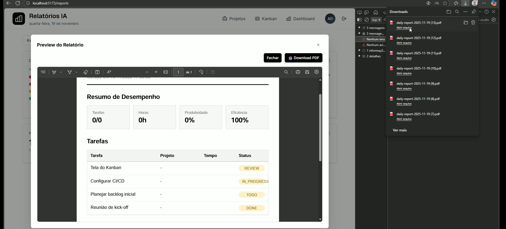

# RF-011

## Compartilhamento seguro de relatórios (Baixar o PDF)

<table>
  <tr>
    <th colspan="6" width="1000">CT-RF-01101 Exportação de Relatório em PDF</th>
  </tr>
  <tr>
    <td width="170"><strong>Critérios de êxito</strong></td>
    <td colspan="5">
      Ao clicar no botão de "Exportar PDF" ou realizar a impressão, o sistema deve gerar um arquivo 
      <code>application/pdf</code> legível. O layout deve ser estruturado profissionalmente.
    </td>
  </tr>
  <tr>
    <td><strong>Responsável pela funcionalidade (desenvolvimento e teste)</strong></td>
    <td width="430">
      Desenvolvimento: Enzo Gomes Azevedo 
      Teste: Adriana Pereira Nascimento
    </td>
    <td width="100"><strong>Data do Teste</strong></td>
    <td width="150">23/11/2025</td>
  </tr>
  <tr>
    <td width="170"><strong>Comentário</strong></td>
    <td colspan="5">
      Funcionalidade validada. O arquivo PDF foi gerado corretamente.
      O layout do documento preserva a formatação visual e os dados conferem com a visualização em tela.
    </td>
  </tr>
  <tr>
    <td colspan="6" align="center"><strong>Evidência</strong></td>
  </tr>
  <tr>
    <td colspan="6" align="center"></td>
  </tr>
</table>

 

---

## Observações Técnicas

**Endpoints testados:**
- `GET /api/reports/export/pdf` (ou geração via cliente)

**Componentes testados:**
- `ExportButton` (`codigo-fonte/frontend/src/components/common/ExportButton.jsx`)
